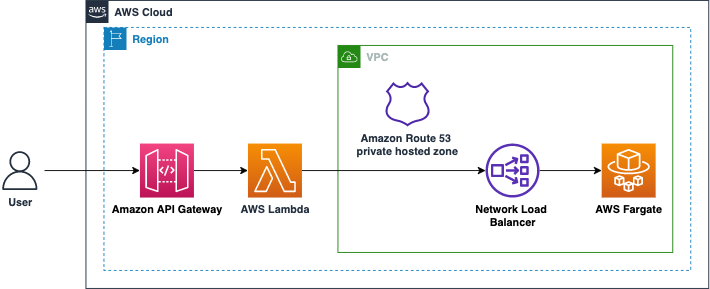
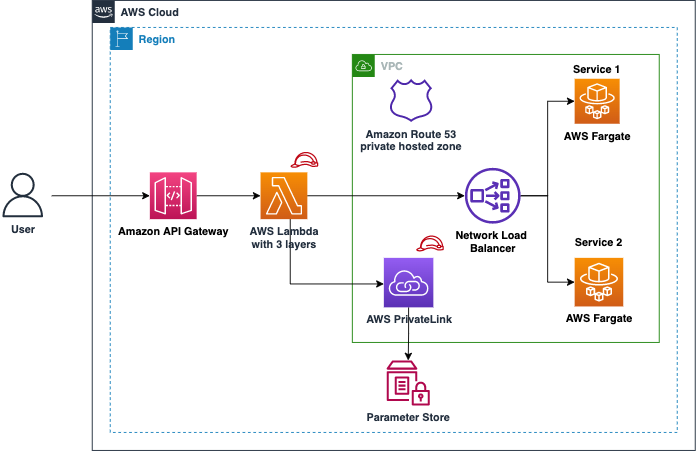

# Mutual TLS for Java based AWS Lambda functions
Modern secure applications establish network connections to other services through HTTPS. 
This is to ensure that the application connects to the right party and to encrypt the data before sending it over the network.
As a service provider, you might not want unauthenticated users to connect to your service. 
One solution to this requirement is to use mutual TLS (Transport Layer Security). 
Mutual TLS (or mTLS) is a common security mechanism that uses client certificates to add an authentication layer. 
This allows the service provider to verify the client’s identity cryptographically.

This sample application uses below architecture to showcase use of mTLS in Java based Lambda functions.

## Overall Architecture


## What is the need of mutual TLS in serverless?
mTLS refers to two parties authenticating each other at the same time when establishing a connection. 
By default, TLS protocol only proves the identity of the server to a client using X.509 certificates. 

With mTLS, a client must prove its identity to the server in order to communicate. 
This supports zero trust policy to protect against adversaries like man-in-the-middle attacks.
mTLS is more often used in business-to-business (B2B) applications and microservices, where inter-service communication needs mutual authentication of parties. 
In Java, you see the following error when the server expects a certificate but the client does not provide one:

```bash
PKIX path building failed: sun.security.provider.certpath.SunCertPathBuilderException: unable to find valid certification path to requested target
```

This application explains multiple ways to implement a Java based [AWS Lambda](https://aws.amazon.com/lambda/) function that supports mTLS to authenticate itself to a third party internal or external service. 

## Understanding KeyStore and TrustStore in Java
A TrustStore is used to store certificate public keys from a Certificate Authority (CA) or trusted servers. 
A client can verify the certificate presented by the server in a TLS connection. 
A KeyStore stores private key and identity certificates that a specific application uses to prove the client's identity.
The concepts are opposite to each other. TrustStore holds identification certificates that identify others, while KeyStore holds the identification certificates that identify itself.

## Overview
To start, you create certificates. For brevity, this sample application uses a [script](scripts/1-create-certificates.sh) that uses OpenSSL and Java’s [keytool](https://docs.oracle.com/en/java/javase/11/tools/keytool.html) for self-signed certificates from a Certificate Authority (CA). 
You store the generated keys in Java KeyStore and TrustStore.
You can find additional details about this script in [Appendix section](#appendix) at the bottom of this page.

However, the best practice for creating and maintaining certificates and Private CA is to use [AWS Certificate Manager](https://aws.amazon.com/certificate-manager/) and [AWS Certificate Manager Private Certificate Authority](https://aws.amazon.com/certificate-manager/private-certificate-authority/).

The following diagram shows the use of KeyStore and TrustStore in the client Lambda function and the server running on [AWS Fargate](https://aws.amazon.com/fargate/):


This demo application contains several Lambda functions. 
The Lambda functions act as clients to services provided by Fargate behind an [Amazon Network Load Balancer](https://aws.amazon.com/elasticloadbalancing/network-load-balancer/) (NLB) running in a private Amazon VPC. 
The setup uses [Amazon Route 53 Private hosted zones](https://docs.aws.amazon.com/Route53/latest/DeveloperGuide/hosted-zones-private.html) to resolve selected hostnames. 
You attach the Lambda functions to this VPC to resolve the hostnames for the NLB. 
To learn more, read how [AWS Lambda uses Hyperplane elastic network interfaces to work with custom VPC](https://aws.amazon.com/blogs/compute/announcing-improved-vpc-networking-for-aws-lambda-functions/).

The following examples refer to portions of [`InfrastructureStack.java`](infrastructure/src/main/java/com/amazon/aws/example/InfrastructureApp.java) and the implementation in the corresponding Lambda functions.

## Provide client certificate in Lambda function artifact
The first option is to provide the KeyStore and TrustStore in a Lambda functions’ zip artifact. You provide the Java environment variables within the Lambda configuration to instruct the JVM to load and trust your provided Keystore and TrustStore. 
JVM accepts these settings instead of Java Runtime Environment’s (JRE) default settings:

```java
Function lambdaOnlyFunction = new Function(this, "LambdaOnlyFunction", FunctionProps.builder()
  .functionName("lambda-only")
  .handler("com.amazon.aws.example.AppClient::handleRequest")
  .runtime(Runtime.JAVA_11)
  .architecture(ARM_64)
  .vpc(vpc)
  .code(Code.fromAsset("../software/1-lambda-only/target/lambda-only.jar"))
  .memorySize(1024)
  .environment(Map.of(
    "BACKEND_SERVICE_1_HOST_NAME", BACKEND_SERVICE_1_HOST_NAME,
    // add option -Djavax.net.debug=all to troubleshoot issues on the client side
    "JAVA_TOOL_OPTIONS", "-Djavax.net.ssl.keyStore=./client_keystore_1.jks -Djavax.net.ssl.keyStorePassword=secret -Djavax.net.ssl.trustStore=./client_truststore.jks -Djavax.net.ssl.trustStorePassword=secret"
  ))
  .timeout(Duration.seconds(10))
  .logRetention(RetentionDays.ONE_WEEK)
  .build());
```

Use a stronger password for your use case. Following approaches highlight how to secure the KeyStore and TrustStore password access. 
The JRE uses this KeyStore and TrustStore to build a default `SSLContext`. HttpClient uses this `SSLContext` to create a TLS connection to the backend service.
The following architecture diagram shows an Amazon API Gateway endpoint with a Lambda proxy integration that calls a backend service running behind an NLB.



This is a good approach for a prototype. However, it has a few shortcomings related to security and separation of duties. KeyStore contains the private key and the password gets exposed which is a security concern. 
Passwords are pushed to source code management (SCM) system. Moreover, it is the Lambda function owner’s responsibility to update the certificate before its expiration. You address these concerns of separation of duties in the next iteration.

## Provide client certificate in Lambda layer
In this approach, you separate the responsibility between two entities. The Lambda function’s owner and the KeyStore and TrustStore’s owner.

The KeyStore and TrustStore owner is responsible for providing them in a secure way to the function developer and is most likely working in a separate AWS environment. 
For simplicity, the demo application uses the same AWS account. The KeyStore and TrustStore owner achieves this by using [AWS Lambda layers](https://docs.aws.amazon.com/lambda/latest/dg/configuration-layers.html). 
The KeyStore and TrustStore owner archives and uploads them as a Lambda layer and only allows access to authorized functions. 
The Lambda function’s owner never gets access to the KeyStore and never manages its lifecycle. 
It is the KeyStore and TrustStore owner’s responsibility to release a new version of this layer when necessary and inform users of it.


The KeyStore and TrustStore are now extracted under path `/opt` as you have included a Lambda layer. The Lambda function can now use the layer as:

```java
Function lambdaLayerFunction = new Function(this, "LambdaLayerFunction", FunctionProps.builder()
  .functionName("lambda-layer")
  .handler("com.amazon.aws.example.AppClient::handleRequest")
  .runtime(Runtime.JAVA_11)
  .architecture(ARM_64)
  .layers(singletonList(lambdaLayerForService1cert))
  .vpc(vpc)
  .code(Code.fromAsset("../software/2-lambda-using-separate-layer/target/lambda-using-separate-layer.jar"))
  .memorySize(1024)
  .environment(Map.of(
    "BACKEND_SERVICE_1_HOST_NAME", BACKEND_SERVICE_1_HOST_NAME,
    // add option -Djavax.net.debug=all to troubleshoot issues on the client side
    "JAVA_TOOL_OPTIONS", "-Djavax.net.ssl.keyStore=/opt/client_keystore_1.jks -Djavax.net.ssl.keyStorePassword=secret -Djavax.net.ssl.trustStore=/opt/client_truststore.jks -Djavax.net.ssl.trustStorePassword=secret"
  ))
  .timeout(Duration.seconds(10))
  .logRetention(RetentionDays.ONE_WEEK)
  .build());
```

KeyStore and TrustStore passwords are still supplied as environment variables, which are prone to leaks. You address this problem with the next approach.

## Store passwords securely in AWS Systems Manager Parameter Store
[AWS Systems Manager Parameter Store](https://docs.aws.amazon.com/systems-manager/latest/userguide/systems-manager-parameter-store.html) provides a secure, hierarchical storage for configuration data and secrets management. 
Parameter Store provides the KeyStore and TrustStore passwords instead of environment variables. 
The Lambda function uses an IAM policy to access Parameter Store and gets the passwords as secure string during the Lambda initialization phase.

```java
List<PolicyStatement> ssmPermissions = List.of(
  PolicyStatement.Builder.create()
    .effect(Effect.ALLOW)
    .actions(List.of("ssm:DescribeParameters"))
    .resources(List.of("*"))
    .build(),
  PolicyStatement.Builder.create()
    .effect(Effect.ALLOW)
    .actions(List.of("ssm:GetParameters", "ssm:GetParameter", "ssm:GetParametersByPath"))
    .resources(List.of(String.format("arn:%s:ssm:%s:%s:parameter/%s", getPartition(), getRegion(), getAccount(), "DEV/APP/CLIENT")))
    .build());

Function lambdaParameterStoreFunction = new Function(this, "LambdaParameterStoreFunction", FunctionProps.builder()
  .functionName("lambda-parameter-store")
  .handler("com.amazon.aws.example.AppClient::handleRequest")
  .runtime(Runtime.JAVA_11)
  .architecture(ARM_64)
  .layers(singletonList(lambdaLayerForService1cert))
  .vpc(vpc)
  .code(Code.fromAsset("../software/3-lambda-using-parameter-store/target/lambda-using-parameter-store.jar"))
  .memorySize(1024)
  .environment(Map.of(
    "BACKEND_SERVICE_1_HOST_NAME", BACKEND_SERVICE_1_HOST_NAME
  ))
  .timeout(Duration.seconds(10))
  .logRetention(RetentionDays.ONE_WEEK)
  .initialPolicy(ssmPermissions)
  .build());
```

With this approach, you build a custom `SSLContext` after successfully looking up the KeyStore and TrustStore passwords from Parameter Store. 
Once you create `SSLContext`, provide that to the HttpClient you use to connect with the backend service:

```java
HttpClient client = HttpClient.newBuilder()
  .version(HttpClient.Version.HTTP_2)
  .connectTimeout(Duration.ofSeconds(5))
  .sslContext(sslContext)
  .build();
```

As a security best practice, you can also use a [VPC interface endpoint for AWS Systems Manager](https://docs.aws.amazon.com/vpc/latest/privatelink/vpce-interface.html#create-interface-endpoint) to keep the traffic from Lambda function to Parameter Store internal to AWS. 
The following diagram shows the interaction between AWS Lambda and Parameter Store:


Above approach works for Lambda functions interacting with a single backend service requiring mTLS. 
However, it is common in a modern microservice architecture to integrate with multiple backend services. 
Sometimes, these services require a client to assume different identities by using different KeyStores. Next approach explains how to handle the multiple services' scenario.

## Provide multiple client certificates in Lambda layers
You can provide multiple KeyStore and TrustStore pairs within multiple Lambda layers.
All layers attached to a function get merged when provisioning the function. Therefore, KeyStore and TrustStore names has to be unique. 
A Lambda function can use up to five Lambda layers (as of Feb. 2022). 
In case Lambda function makes multiple service calls and each of them require different mTLS setup, based on your need consider merging and maintaining one layer for all TrustStore and KeyStore with different names.

Similar to the previous approach, you load multiple KeyStores and TrustStores to construct multiple `SSLContext` objects. 
You abstract the common logic to create an `SSLContext` object in another Lambda layer. 
Now, the Lambda function calling two different backend services uses 3 Lambda layers:
 - Lambda layer for backend service 1 (under `/opt`)
 - Lambda layer for backend service 2 (under `/opt`)
 - Lambda layer for the SSL utility that takes KeyStore, TrustStore, and their passwords to return an `SSLContext` object

```java
Function lambdaMultipleCertificatesFunction = new Function(this, "LambdaMultipleCertificatesFunction", FunctionProps.builder()
  .functionName("lambda-multiple-certificates")
  .handler("com.amazon.aws.example.AppClient::handleRequest")
  .runtime(Runtime.JAVA_11)
  .architecture(ARM_64)
  .layers(List.of(lambdaLayerForService1cert, lambdaLayerForService2cert, lambdaLayerForSSLUtility))
  .vpc(vpc)
  .code(Code.fromAsset("../software/4-lambda-using-multiple-certificates/target/lambda-using-multiple-certificates.jar"))
  .memorySize(1024)
  .environment(Map.of(
    "BACKEND_SERVICE_1_HOST_NAME", BACKEND_SERVICE_1_HOST_NAME,
    "BACKEND_SERVICE_2_HOST_NAME", BACKEND_SERVICE_2_HOST_NAME
  ))
  .timeout(Duration.seconds(10))
  .logRetention(RetentionDays.ONE_WEEK)
  .initialPolicy(ssmPermissions)
  .build());
```

[SSL utility Lambda layer](software/lambda-ssl-utility-layer/src/main/java/com/amazon/aws/lambda/layer/TrustAndKeyStore.java) provides `getSSLContext` as a default method in a Java interface.
The Lambda function implements this interface. Now, you can create dedicated HTTP client per service.

```java
public AppClient() throws NoSuchAlgorithmException, UnrecoverableKeyException, KeyStoreException,
  CertificateException, IOException, KeyManagementException {

  Map<String, String> values = ssmProvider.recursive().withDecryption().getMultiple("/DEV/APP/CLIENT");
  String keyStorePassword = values.get("KEYSTORE/PASSWORD");
  String trustStorePassword = values.get("TRUSTSTORE/PASSWORD");

  SSLContext sslContextBackendService1 = getSSLContext(
    "/opt/client_keystore_1.jks",
    keyStorePassword,
    "/opt/client_truststore.jks",
    trustStorePassword
  );

  SSLContext sslContextBackendService2 = getSSLContext(
    "/opt/client_keystore_2.jks",
    keyStorePassword,
    "/opt/client_truststore.jks",
    trustStorePassword
  );

  clientBackendService1 = HttpClient.newBuilder()
    .version(HttpClient.Version.HTTP_2)
    .connectTimeout(Duration.ofSeconds(5))
    .sslContext(sslContextBackendService1)
    .build();

  clientBackendService2 = HttpClient.newBuilder()
    .version(HttpClient.Version.HTTP_2)
    .connectTimeout(Duration.ofSeconds(5))
    .sslContext(sslContextBackendService2)
    .build();
}
```

The following diagram shows your final architecture:



## Setup

### Prerequisites
To run the sample application, you need:
1. [CDK v2](https://docs.aws.amazon.com/cdk/v2/guide/getting_started.html)
2. [Java 11](https://docs.aws.amazon.com/corretto/latest/corretto-11-ug/what-is-corretto-11.html)
3. [Maven](https://maven.apache.org/download.cgi)
4. [AWS CLI](https://docs.aws.amazon.com/cli/latest/userguide/getting-started-install.html)
5. [Docker](https://www.docker.com/)
6. [jq](https://stedolan.github.io/jq/)

### Build and Deploy
To build and provision the stack:

 - Clone the git repository:
  ```bash
  git clone https://github.com/aws-samples/serverless-mutual-tls.git
  cd serverless-mutual-tls
  ```
> Run all the following Shell commands in the root directory of this project!

 - Create the root CA, client, and server certificates:
 ```bash
 ./scripts/1-create-certificates.sh
 ```
 - Build and package:
 ```bash
 ./scripts/2-build_and_package-functions.sh
 ```
 > Make sure that docker is running before executing next step
 - Provision the AWS infrastructure:
 ```bash
 ./scripts/3-provision-infrastructure.sh
 ```
 
## Verification
Verify that the API endpoints are working and actually using mTLS by running below curl commands from base directory:

```bash
export API_ENDPOINT=$(cat infrastructure/target/outputs.json | jq -r '.LambdaMutualTLS.apiendpoint')
```

Run below command to witness the error when mTLS is not used in Lambda function:

```bash
curl -i $API_ENDPOINT/lambda-no-mtls
```
For successful usage of mTLS as shown in above use cases, run below commands:
```bash
curl -i $API_ENDPOINT/lambda-only
curl -i $API_ENDPOINT/lambda-layer
curl -i $API_ENDPOINT/lambda-multiple-certificates
curl -i $API_ENDPOINT/lambda-parameter-store
```

## Additional Security

In addition to above approaches with mTLS in Java based Lambda functions, you can add other controls via Java environment variables. 
Compliance standards like [PCI DSS](https://aws.amazon.com/compliance/pci-dss-level-1-faqs/) prevalent in Financial Services industries require customers to exercise more control over the underlying negotiated protocol and ciphers.

Some useful Java environment variables to troubleshoot SSL/TLS connectivity issues in your Lambda function are:

```bash
-Djavax.net.debug=all
-Djavax.net.debug=ssl,handshake
-Djavax.net.debug=ssl:handshake:verbose:keymanager:trustmanager
-Djavax.net.debug=ssl:record:plaintext
```

You can also provide specific version of TLS, e.g. v1.3 to meet strict regulatory requirements by using:

```bash
-Dhttps.protocols=TLSv1.3
```

You can programmatically construct `SSLContext` inside the Lambda function like:

```java
SSLContext sslContext = SSLContext.getInstance("TLSv1.3");
```

You can also use the following Java environment variable to limit the use of weak cipher suites or unapproved algorithms and explicitly provide the supported cipher suites:

```bash
-Dhttps.cipherSuites=TLS_ECDHE_ECDSA_WITH_AES_128_GCM_SHA256,TLS_ECDHE_ECDSA_WITH_AES_256_GCM_SHA384,TLS_ECDHE_ECDSA_WITH_AES_128_CBC_SHA,TLS_ECDHE_ECDSA_WITH_AES_256_CBC_SHA,TLS_ECDHE_ECDSA_WITH_AES_128_CBC_SHA256,TLS_ECDHE_ECDSA_WITH_AES_256_CBC_SHA384,TLS_ECDHE_RSA_WITH_AES_128_GCM_SHA256,TLS_ECDHE_RSA_WITH_AES_256_GCM_SHA384,TLS_ECDHE_RSA_WITH_AES_128_CBC_SHA,TLS_ECDHE_RSA_WITH_AES_256_CBC_SHA,TLS_ECDHE_RSA_WITH_AES_128_CBC_SHA256,TLS_ECDHE_RSA_WITH_AES_256_CBC_SHA384,TLS_DHE_RSA_WITH_AES_128_GCM_SHA256,TLS_DHE_RSA_WITH_AES_256_GCM_SHA384,TLS_DHE_RSA_WITH_AES_128_CBC_SHA,TLS_DHE_RSA_WITH_AES_256_CBC_SHA,TLS_DHE_RSA_WITH_AES_128_CBC_SHA256,TLS_DHE_RSA_WITH_AES_256_CBC_SHA256
```

You can achieve the same programmatically with the following code snippet:

```java
httpClient = HttpClient.newBuilder()
  .version(HttpClient.Version.HTTP_2)
  .connectTimeout(Duration.ofSeconds(5))
  .sslContext(sslContext)
  .sslParameters(new SSLParameters(new String[]{
    "TLS_ECDHE_ECDSA_WITH_AES_128_GCM_SHA256",
    "TLS_ECDHE_ECDSA_WITH_AES_256_GCM_SHA384",
    "TLS_ECDHE_ECDSA_WITH_AES_128_CBC_SHA",
    . . .
  }))
  .build();
```

## Cleanup
The stack creates custom VPC and other related resources. 
Cleanup after usage to avoid ongoing cost of running these services. 
To clean up the infrastructure and the self-generated certificates, run below commands:

```bash
./scripts/4-delete-certificates.sh

./scripts/5-deprovision-infrastructure.sh
```

## Conclusion
mTLS in Java using KeyStore and TrustStore has been in use for a long time now. 
This app highlights the four approaches that you can take to implement mutual TLS in Serverless using Java based Lambda functions. 
Each approach addresses the separation of concern needed while implementing mTLS with additional security features. 
You can use any approach from above that suits your need, organizational security best practices, and enterprise requirements. 


## Appendix

`1-create-certificates.sh` script does the following:
 - Generates two different root CA private keys for two different backend services 
 - Creates and self signs the root CA public keys
 - Creates the two backend services certificates
 - Creates TrustStore for a Lambda function, copies signed backend services public key to the Lambda functions’ TrustStore
 - Generates Lambda functions’ KeyStores per backend service, signs them, and imports the signed client public key into the Lambda functions’ resources and Lambda layers’ resources. More about it is explained in each approach.
 - Finally, copies the backend and Lambda function certificates to respective modules

## Contributors
 - [Christian Mueller](https://github.com/muellerc)
 - [Dhiraj Mahapatro](https://github.com/dmahapatro)

## Security

See [CONTRIBUTING](CONTRIBUTING.md#security-issue-notifications) for more information.

## License

This library is licensed under the MIT-0 License. See the LICENSE file.
